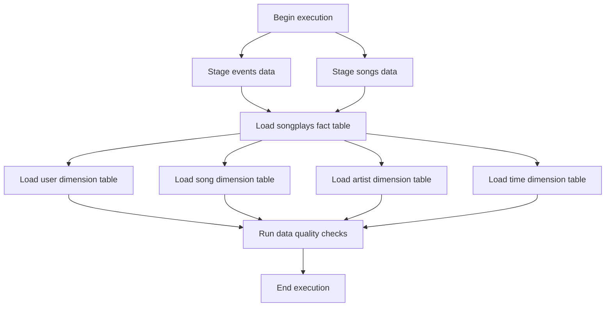

# Data Pipelines with Airflow

## Project Overview

This demonstrates the implementation of a robust ETL (Extract, Transform, Load) pipeline using Apache Airflow for a music streaming company, Sparkify.

## Purpose

The goal of this project is to create high-grade data pipelines that are dynamic, built from reusable tasks, easily monitored, and allow for simple backfills. The pipeline extracts data from S3, stages it in Redshift, and transforms it into a set of dimensional tables for the analytics team to continue finding insights into what songs their users are listening to.

## Tools and Technologies

- Apache Airflow
- Amazon Web Services (AWS)
    - S3 (data storage)
    - Redshift (data warehouse)
- Python

## DAG Workflow

---

*This project is part of the Udacity Data Engineering with AWS Nanodegree program.*